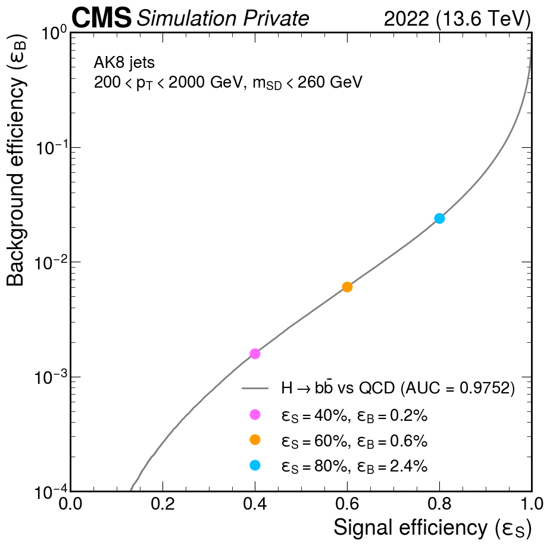
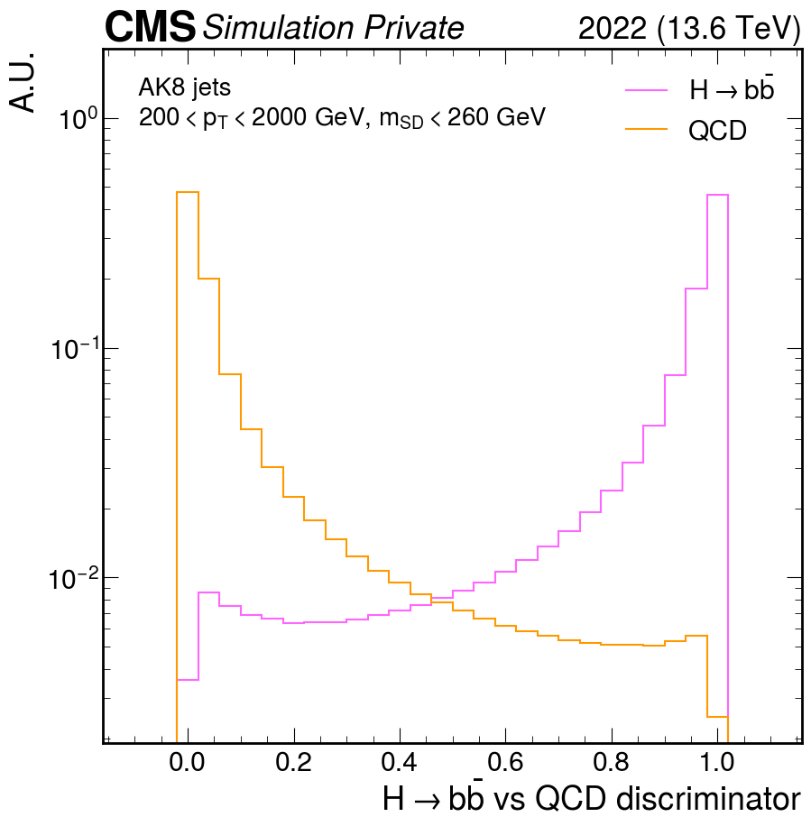
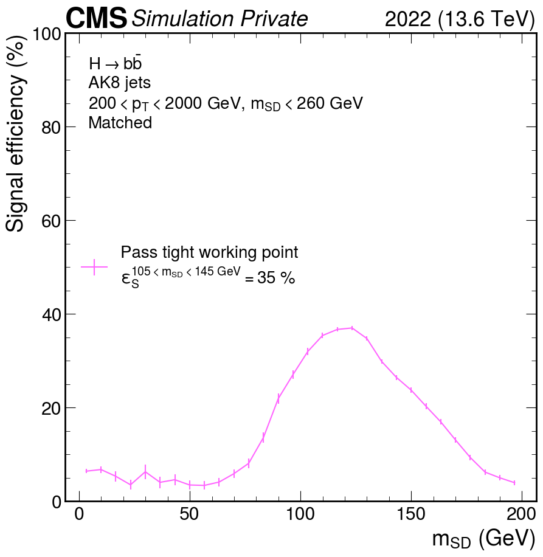
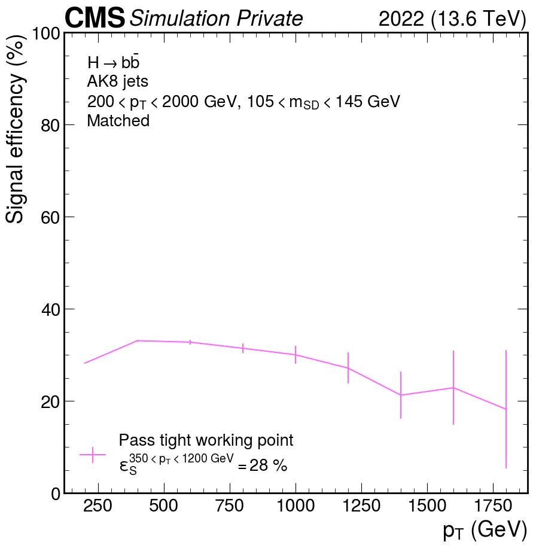

# How to evaluate AK8 flavour tagging

## Contents of this repository

1. [ROC curve](#roc-curve)
2. [Distribution of discriminator](#distribution-of-discriminator)
3. [Signal efficiency](#signal-efficiency)

## ROC curve

The ROC curve serves as a crucial tool in evaluating the performance of a neural network designed to classify particle interactions. In the specific context of discriminating between Higgs to bb and QCD events, the ROC curve visually represents the trade-off between the ratio of signal events correctly classified as signal (signal efficiency or true positive rate) and the background events wrongly classified as signal (background efficiency or false positive rate). The area under the ROC curve (AUC) quantifies the overall performance, with a higher AUC indicating better classifier performance.

Selecting appropriate working points (WP) for a Higgs to bb versus QCD classifier involves choosing specific discrimination thresholds that align with desired signal efficiencies. Commonly used WP include 40%, 60%, and 80% signal efficiency. These points represent different trade-offs between maximising signal identification and minimising false positives, allowing tailoring the classifier's performance based on the analysis' objectives.

The code to produce the following ROC curve can be found in [flavour.ipynb](flavour.ipynb). In the figure, three WP of 40%, 60% and 80% signal efficiency has been marked.

## Distribution of discriminator

The distribution of discriminants provides valuable insights into the efficacy of the network. The discriminant distribution represents the network's output scores for each event, reflecting the model's confidence in assigning a given event to either the signal (Higgs to bb) or background (QCD) class. Examining this distribution facilitates understanding of the separation between the two classes and aids identify the threshold that optimally distinguishes signal from background. A well-separated distribution indicates effective discrimination.

The code to produce the following distribution can be found in [flavour.ipynb](flavour.ipynb).

## Signal efficiency

It may be helpful to plot the signal efficiency as a function of different kinematic variables in order to identify potential discrepancies. This allows for a comprehensive exploration of the classifier's performance across various event characteristics. The code to produce the signal efficiency as a function of momentum and softdrop mass can be found in [flavour_and_massreg.ipynb](flavour_and_massreg.ipynb).

