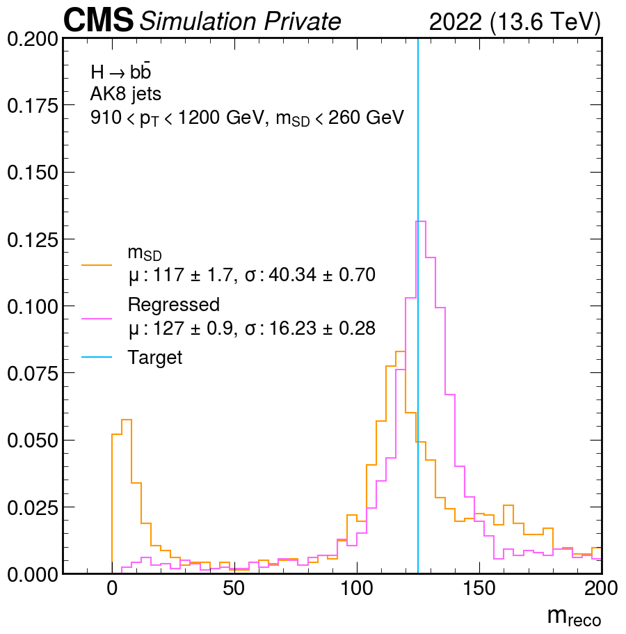
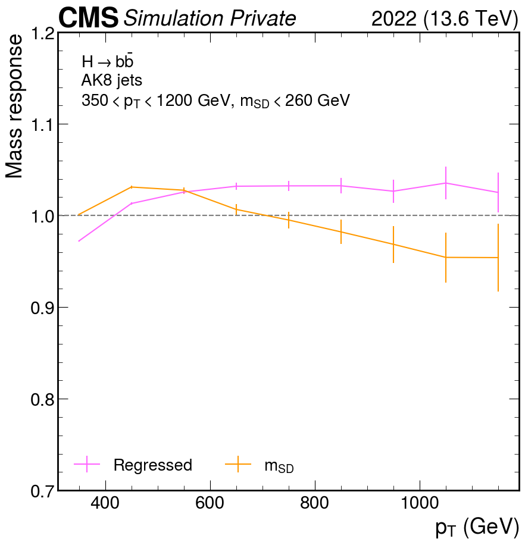
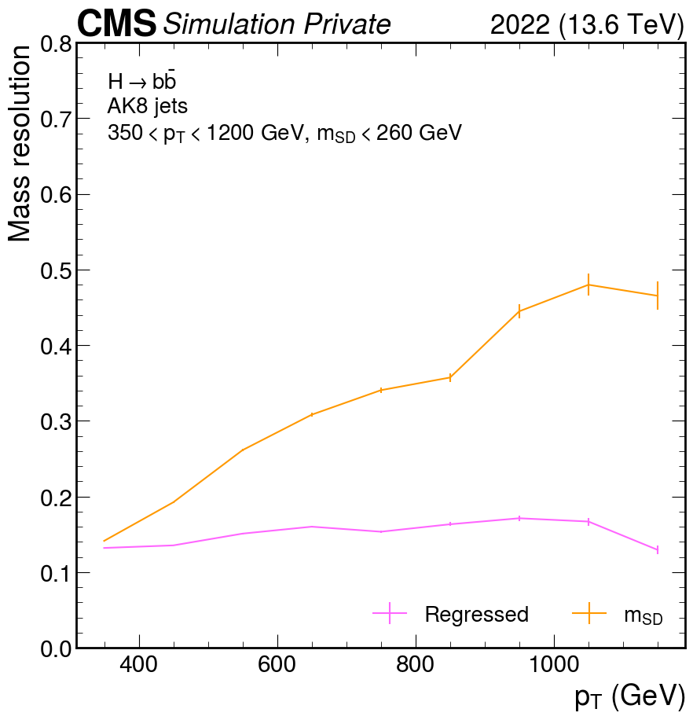

# How to evaluate AK8 mass regression

## Contents of this repository

1. [Mass distribution](#mass-distribution)
2. [Mass response and resolution](#mass-response-and-resolution)

## Mass distribution

The mass distribution should be centered around the target mass (125 GeV in the figure below). The code to produce the mass distribution can be found in [massreg.ipynb](massreg.ipynb).

## Mass response and resolution

The mass response and resolution provides valuable insights into the efficacy of the regression. Both are evaluated by first constructing a distribution of reconstructed mass to target mass. The response and resolution are then estmated as the median and standard deviation, respectively. The response should be constant and centered around 1, while the resolution is expected to be around 0.1. It is common for the mass resolution to be a little bit worse at low momentum.

The code to produce the mass response and resolution as a function of momentum can be found in [massreg.ipynb](massreg.ipynb).

